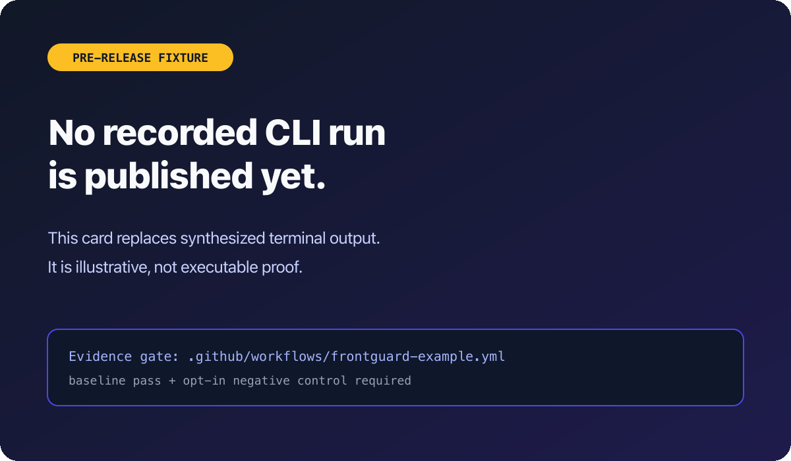

# 🛡️ Frontguard

[](https://github.com/ravidsrk/frontguard/actions/workflows/ci.yml)
[](https://www.npmjs.com/package/@frontguard/cli)
[](https://www.npmjs.com/package/@frontguard/playwright)
[](./LICENSE)

**AI-powered frontend visual regression testing for web teams — detect, understand, and fix visual bugs before they ship to production.**

Frontguard gives frontend teams a local, inspectable screenshot comparison loop without requiring a hosted account.

> **multi-browser** · **optional AI vision analysis** · **local-first** · **MIT**
>
> _Current test, source, version, and bundle metrics are derived by [`scripts/stats.ts`](./scripts/stats.ts). See [`scripts/stats.json`](./scripts/stats.json) for the canonical snapshot._

<p align="center">
  <br/>
  <em>📽️ Demo: <code>frontguard init</code> → <code>doctor</code> → <code>run</code> → AI classification.</em>
</p>

<!-- To re-render the demo GIF: `vhs demo/frontguard-demo.tape` (requires `brew install vhs`). -->

> ### Published package line: 0.2.2
>
> Published packages are listed in [CHANGELOG.md](./CHANGELOG.md). The first validation run is documented in [`validation/results-v0.2.md`](./validation/results-v0.2.md): 39 of 43 route rechecks completed across 2 of 5 fixture repositories on one macOS host, with AI disabled. It is not an AI-accuracy or cross-OS benchmark.

## Built in the open

The MIT-licensed repository contains the CLI, optional AI pipeline, cloud API source, integrations, MCP server, and Docker renderer source. The local CLI is the supported product path. Hosted, MCP, GitHub App, and Docker Compose onboarding remain pre-release; see the [launch audit](./docs/launch-audit-2026-08.md) for the unresolved acceptance work.

AI is optional; without it, the CLI performs local pixel comparison and writes local reports. Cloud source and the [self-host guide](https://frontguard.dev/docs/self-host) are available for evaluation, not as a verified production quick start.

## Why Frontguard?

- **🧠 Optional model-assisted analysis** — When configured, sends screenshot evidence to your selected OpenAI or Anthropic account and returns a classification, confidence, and explanation for review.
- **🎯 Configurable consensus** — Opt into multiple renders per route when a project needs protection from transient screenshot variation.
- **🤖 Pre-release MCP interface** — [`@frontguard/mcp`](https://www.npmjs.com/package/@frontguard/mcp) can query a verified API deployment; there is no live hosted default, and cloud approval does not yet promote screenshots.
- **🐳 Pinned renderer source** — The renderer is currently repository-source-only and must be built with the documented npm tarball preparation. Cross-host byte equivalence has not yet been validated and no registry image is published.
- **🔓 Open-source CLI** — CLI-first, free forever. No per-screenshot pricing cliff, no dashboard lock-in, BYO AI key. Cloud components are available in the repository but their hosted and Docker quick starts are still pre-release.

## What It Does

```
Developer runs Frontguard → Pages render → Pixels compare to reviewed baselines →
Console, JSON, and HTML evidence are written → Optional AI assists with changed screenshots
```

- **Detect** — Pixel comparison finds changes above the configured threshold
- **Understand** — Optional AI returns a confidence-scored explanation for human review
- **Fix** — Experimental CSS suggestions and sandbox verification are separate opt-ins

## Quick Start

**Prerequisites:** [Node.js](https://nodejs.org/) 20+ and npm 9+

```bash
# Frontguard terminal: install, initialize, and check the environment
npm install @frontguard/cli
npx -p @frontguard/cli frontguard init --ci
npx -p @frontguard/cli frontguard doctor
```

**App terminal (leave this running):** use your project's dev-server command (for example, the command below) and wait for the `baseUrl` generated in `frontguard.config.ts` to respond.

```bash
npm run dev
```

**Frontguard terminal:** review the running app, then capture baselines and compare using the generated config.

```bash
npx -p @frontguard/cli frontguard update-baselines
git push origin frontguard-baselines
npx -p @frontguard/cli frontguard run
```

> **Full documentation:** [frontguard.dev/docs](https://frontguard.dev/docs) · internal notes in [`docs/`](./docs/)

## Features

- **Zero-config route discovery** — Auto-crawls your app to find all pages
- **Multi-browser** — Chromium, Firefox, WebKit via Playwright
- **AI-powered analysis** — BYOK (OpenAI/Anthropic) classifies regressions vs intentional changes
- **Smart rendering** — Dependency graph renders only pages affected by your changes
- **Preview deployments** — Auto-detects Vercel/Netlify preview URLs
- **Git-native baselines** — Stored in orphan branch, zero main branch bloat
- **Framework detection** — Next.js, Remix, SvelteKit, Nuxt, Astro out of the box
- **Security hardened** — Shell injection prevention, path traversal guards, API key redaction
- **Memory managed** — Streaming buffers, temp file cleanup, bounded concurrency
- **Visual evidence** — Baseline/current/diff images are retained in the HTML report; remote thumbnails require an explicit image-upload backend
- **Per-route thresholds** — Strict on `/checkout`, relaxed on `/blog` — all in one config

## How Frontguard Compares

| | Frontguard | Percy | Chromatic | BackstopJS | Lost Pixel | Argos |
|---|:---:|:---:|:---:|:---:|:---:|:---:|
| Open source | ✅ MIT | ❌ | ◐ | ✅ | ◐ (read-only) | ✅ MIT |
| CLI-first | ✅ | ❌ | ❌ | ✅ | ✅ | ✅ |
| **AI change classification** | ✅ optional | ◐ | ❌ | ❌ | ❌ | ❌ |
| AI fix verification | ◐ experimental | ❌ | ❌ | ❌ | ❌ | ❌ |
| Multi-render consensus | ◐ configurable | ◐ | ◐ | ❌ | ❌ | ◐ |
| Runs without a hosted service | ✅ | ❌ | ❌ | ✅ | ◐ | ◐ |
| Free tier | Forever (CLI) | 5k screenshots/mo | 5k snapshots/mo | Free | Sunset | 5k screenshots/mo |
| Hosted entry | Waitlist | $199/mo | $179/mo | n/a | n/a | $100/mo |
| Project status | Active | Active | Active | Low activity observed | Sunset; team joined Figma | Active |

> Migrating? See the [BackstopJS](https://frontguard.dev/docs/guides/migrate-from-backstopjs), [Lost Pixel](https://frontguard.dev/docs/guides/migrate-from-lost-pixel), and [Argos](https://frontguard.dev/docs/comparisons/frontguard-vs-argos) guides. Comparisons: [Percy](https://frontguard.dev/docs/comparisons/frontguard-vs-percy) · [Chromatic](https://frontguard.dev/docs/comparisons/frontguard-vs-chromatic) · [Argos](https://frontguard.dev/docs/comparisons/frontguard-vs-argos).

## AI Classification Output Shape

Illustrative output only; the published validation run did not measure model accuracy.

```
  ✘ /dashboard @ 375px — 2.34% changed
    🔴 AI Analysis — Regression (94% confidence)
    "The sidebar overlaps the main content on mobile. Review the responsive
     layout rules affecting the sidebar and content container."
    Suggested fix (unverified): restore column stacking at the mobile breakpoint.

  ✓ /pricing @ 1440px — 0.8% changed
    🟢 AI Analysis — Intentional (91% confidence)
    "New 'Enterprise' pricing tier added. Layout intact, content expanded."
```

## Configuration

```typescript
// frontguard.config.ts
export default {
  version: 1,
  baseUrl: 'http://localhost:3000',

  // Auto-discover routes (zero config)
  discover: {
    startUrl: '/',
    maxDepth: 3,
    exclude: ['/admin/*', '/api/*'],
  },

  // Or explicit routes
  // routes: ['/', '/pricing', '/checkout'],

  viewports: [375, 768, 1440],
  browsers: ['chromium'],
  threshold: 0.1, // changed-pixel ratio: 0.1 = 10%

  // AI analysis (optional, BYOK)
  ai: {
    provider: 'openai',
    model: 'gpt-4o',
  },

  // Ignore dynamic content
  ignore: [
    { selector: '.dynamic-timestamp' },
  ],
};
```

## How It Works

```
ROUTE DISCOVERY → PLAYWRIGHT RENDER → PIXEL COMPARISON → CONSOLE / JSON / HTML
                                                └──────→ OPTIONAL BYOK AI ANALYSIS
```

## CLI Output

```
 frontguard

 🔍 Discovering routes... found 47 routes
 📊 12/47 routes affected by changed files
 🖥  Rendering 12 routes × 3 viewports

 ───────────────────────────────────────────
  RESULTS                        12 routes
 ───────────────────────────────────────────
  ✓ /                375  768  1440   PASS
  ✓ /pricing         375  768  1440   PASS
  ⚠ /checkout        375  768  1440   WARNING
  ✘ /dashboard       375  768  1440   REGRESSION
  ★ /settings        375  768  1440   NEW
 ───────────────────────────────────────────

  ✘ /dashboard @ 375px
    AI: "At 375px, the current screenshot shows the sidebar overlapping
         the main content; the baseline keeps both regions separate."
    Guidance: Review responsive stacking for this viewport.
    Severity: 🔴 Critical (confidence: 94%)

  1 regression · 1 warning · 9 passed · 1 new
```

## Plugins

Frontguard ships with a plugin architecture (9 lifecycle hooks) and 5 built-in plugins:

| Plugin | Description | Key Features |
|--------|-------------|--------------|
| **Figma** (`packages/cli/src/plugins/figma.ts`) | Design-to-code comparison | Figma API integration, design token extraction, component mapping |
| **Performance Budgets** (`packages/cli/src/plugins/perf-budgets.ts`) | Web Vitals & budgets | LCP/CLS/TTFB thresholds, violations correlated with the visual diff |
| **Accessibility** (`packages/cli/src/plugins/accessibility.ts`) | axe-core audits | WCAG checks (contrast, alt text, target size, focus, headings) in the same render pass |
| **Third-Party Scripts** (`packages/cli/src/plugins/third-party-scripts.ts`) | Script drift detection | Flags ad/analytics/widget origins that appear or disappear between runs |
| **Monitor** (`packages/cli/src/plugins/monitor.ts`) | Production visual monitoring (CLI + optional cloud scheduler) | Live-URL checks, threshold alerting, history tracking |

**Plugin lifecycle hooks:** `setup`, `beforeDiscover`, `afterDiscover`, `beforeRender`, `afterRender`, `afterCompare`, `afterRun`, `onError`, `teardown`

```typescript
// frontguard.config.ts
import { createFigmaPlugin } from '@frontguard/cli/plugins';

export default {
  // ...base config
  plugins: [
    createFigmaPlugin({ fileKey: 'your-figma-file-key' }),
  ],
};
```

## Architecture

```
packages/
├── cli/src/          # @frontguard/cli — discover → render → diff → report
│   ├── cli/          # Commander entry
│   ├── core/         # Pipeline orchestrator, types, config, plugin system
│   ├── discovery/    # Route discovery (crawler + filesystem)
│   ├── render/       # Playwright rendering engine
│   ├── diff/         # Pixel diff + AI vision analysis
│   ├── storage/      # Git orphan branch baselines
│   ├── report/       # Console, JSON, HTML, GitHub PR reporters
│   ├── plugins/      # Figma, perf budgets, a11y, third-party, monitor
│   └── utils/        # Redaction, logging, retry
├── playwright/       # @frontguard/playwright
├── mcp/              # @frontguard/mcp
├── cloud-api/        # Cloudflare Workers + D1 + R2
└── create-frontguard-plugin/
apps/
├── web/              # docs site
└── demo/
integrations/
├── github-app/
├── vercel/
├── netlify/
└── slack-app/
```

Pipeline: `discover → filter → render → diff → analyze → report`

Each stage is independent with error boundaries — one page failing doesn't kill the run.

## Documentation

See [`docs/`](./docs/) for:
- [Product deep-dive](./docs/PRODUCT.md) — Architecture decisions and design rationale
- [Launch readiness (v0.2.0)](./docs/launch-readiness.md) — Go/no-go for the 2026-06-17 release, 20-PR punch list, residual risks
- [Adversarial review](./docs/adversarial-review.md) — The audit we held v0.2.0 to
- [Product-completion plan](./docs/product-completion-plan.md) — The frozen IN / ROADMAP / FIX boundary
- [Research](./docs/research.md) — Mid-2026 competitive landscape (16 competitors fetched live)
- [Validation results](./validation/results-v0.2.md) — Real harness run, real numbers

## Roadmap

See [ROADMAP.md](./docs/ROADMAP.md) for the full milestone history and upcoming plans.

## Releasing

The release flow is documented and reproducible — no hidden steps.

1. Tag a version: `git tag -a v0.X.Y -m "..."` and `git push origin v0.X.Y`.
2. [`.github/workflows/release.yml`](./.github/workflows/release.yml) runs on the tag push: `scripts/release.sh --dry-run` first as a sanity check, then real publish with `NPM_TOKEN` from repo secrets (provenance signing in CI). Marketplace submissions emit as a workflow summary.
3. [`scripts/release.sh`](./scripts/release.sh) is the single source of truth. Run it locally with `--dry-run` for any audit — `npm pack --dry-run` per package, manifest checks, no state mutated.

Idempotent: already-published versions are skipped automatically. Scoped packages are forced `public` after publish so org defaults can't silently restrict them.

## Environment Variables

```bash
# AI Analysis (optional, BYOK — bring your own key, pick one)
FRONTGUARD_OPENAI_KEY=sk-...
FRONTGUARD_ANTHROPIC_KEY=...

```

> **Note:** AI keys are optional. Frontguard works without them using local pixel comparison. AI analysis activates only when you configure a provider and sends screenshot evidence directly to that provider.

## Contributing

Contributions welcome! See [CONTRIBUTING.md](./CONTRIBUTING.md) for guidelines, development setup, and how to submit PRs.

## License

MIT
