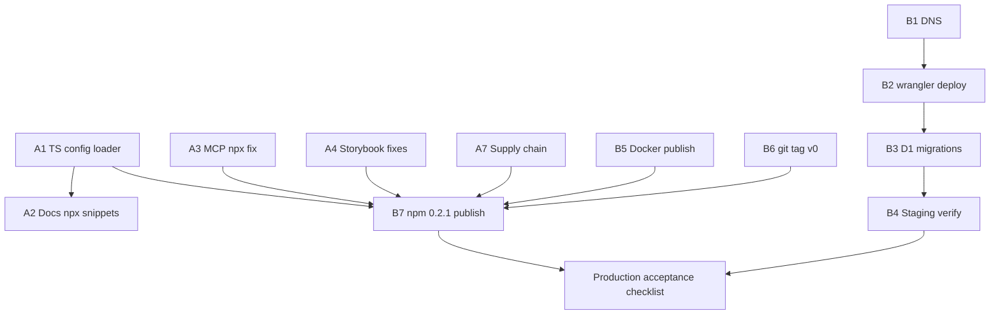

# Frontguard — Production Pending Work (Deep Inventory)

*Compiled 2026-06-17 against `origin/main` @ `b472457` after adversarial re-check.
This is the single canonical list of everything still blocking a honest production
release. It reconciles three audit tracks, live repros, and the OPS queue.*

**Related artifacts (read in this order):**

| Doc | What it covers | Status |
|-----|----------------|--------|
| [`adversarial-v020-postship.md`](./adversarial-v020-postship.md) | Original 49 confirmed post-ship findings (v0.2.0) | Reconciled in [`fix-progress.md`](./fix-progress.md): 36 CLOSED / 13 CODE_CLOSED / 0 OPEN |
| [`adversarial-review-fresh.md`](./adversarial-review-fresh.md) | Second-pass architecture review (31 findings) | **31/31 code-closed** per [`arch-build-readiness.md`](./arch-build-readiness.md) |
| [`arch-ops-actions.md`](./arch-ops-actions.md) | OPS / verify-at-scale queue for fresh review | **Not executed** — human-owned (O1–O15) |
| [`fix-plan.md`](./fix-plan.md) | Per-cluster remediation recipes for the 49 | Reference only |

---

## Executive summary

Frontguard has had **two major remediation passes**:

1. **v0.2.0 post-ship audit (49 findings)** — customer-path, docs, distribution, Storybook, MCP. Roughly **half closed in code on `main`**, half still open. The coordinator ledger was never updated.
2. **Adversarial-fresh architecture audit (31 findings)** — cloud-api reliability, billing, D1, SSRF, actions. **All 31 closed in code**; **3 are CODE_CLOSED** pending staging/prod verification; **8+ OPS items** not applied.

**Production verdict (T_FINAL @ `aad7733`, 2026-06-20):** **CONDITIONAL GO.**

| Blocker class | Count | Owner | Status |
|---------------|------:|-------|--------|
| Open code defects (original 49) | **0** | Engineering | **CLOSED** — Wave A+B merged (#94–#105) |
| CODE_CLOSED pending OPS (original 49) | **13** | Human ops | Mitigated in code; live closure requires OPS |
| OPS / infra (DNS, deploy, migrations, Docker publish) | **15** | Human ops | Queue complete in [`arch-ops-actions.md`](./arch-ops-actions.md); **NOT executed** |
| npm republish (`0.2.0` on registry lacks fixes) | **1 release** | Release engineer | **Prep done** (0.2.1 staged PR#107); publish = OPS O11 |
| Process / doc hygiene (stale ledgers, SECURITY.md) | **0** | Engineering | Reconciled PR#106 + T_FINAL |

Honest shipping label: **“OSS CLI shippable in-repo — publish 0.2.1 via OPS O11 before external
evaluators; cloud/SaaS not operational until OPS queue completes.”**

---

## What already landed (do not re-fix)

These were P0 in the original audit and are **verified fixed** on current `main`:

| Area | Fix | Key files |
|------|-----|-----------|
| Session auth | Production fail-closed; dev-only fallback renamed | `packages/cloud-api/src/auth/session.ts` |
| Cloud regressions | R2 baseline restore before Daytona run | `packages/cloud-api/src/daytona-runner.ts` (`restoreBaselines`) |
| Async runs | `executionCtx.waitUntil(processRun)` | `packages/cloud-api/src/index.ts:488` |
| SSRF (submit-time) | Shared `render-target.ts` guard on `/v1/run` | `packages/cloud-api/src/security/render-target.ts` |
| Scheduler | Baseline restore + tick scaling + failure alerts | `packages/cloud-api/src/scheduler.ts` (PR#79) |
| Slack results | Reads `status` strings, not `regression` booleans | `integrations/slack-app/src/runs.ts` |
| GitHub Action | Root `action.yml` shim + `@v0` ref in bootstrap PR | `action.yml`, `integrations/github-app/src/github-api.ts` |
| Init gitignore | `node_modules/` added | `packages/cli/src/cli/init.ts:253` |
| Docker platform | `--platform linux/amd64` default | `packages/cli/src/render/docker.ts` |
| MCP github linkage | `run.github` in D1 config blob | `packages/cloud-api/src/db/d1-store.ts:94` |
| MCP suggestedFix | Plumbed through processor | `packages/cloud-api/src/processor.ts` |
| MCP team listing | `GET /v1/runs` includes team runs | `packages/cloud-api/src/index.ts:538-558` |
| Pricing truth | Pro no longer advertises production monitoring | `apps/web/src/routes/pricing.tsx` |
| npm README | `packages/cli/README.md` synced | `packages/cli/README.md` |
| Root README Quick Start | Uses `npx -p @frontguard/cli frontguard` | `README.md:62-71` |
| Daytona snapshot | `@frontguard/cli@<version>` not `frontguard@latest` | `scripts/build-daytona-snapshot.ts` |
| D1 migrations | Versioned chain 001→005 | `packages/cloud-api/src/db/migrations/` |
| Report version drift | No hardcoded `v0.1.0` in cloud-api src | grep clean |

**Engineering gates (2026-06-17):** `npm ci && npm run build && npm test` — all workspace suites pass (~1,900+ tests).

---

## Pending work — by priority wave

### Wave A — Unblock evaluators (code, ~1 week)

These are the highest-leverage **code** items. A new user following docs still fails within minutes without these.

#### A1. TypeScript config loader (`install-1`, `sb-2`) — **P0 OPEN**

**Problem.** `frontguard init` defaults to `--format ts` and writes `frontguard.config.ts`. `loadConfigFile()` uses bare Node `import()` with no TS hook. Any `.ts` config fails:

```
Unknown file extension ".ts" for .../frontguard.config.ts
```

**Evidence (reproduced on built CLI from `main`):**

```bash
git init && npm install ./packages/cli
npx frontguard init
npx frontguard doctor   # Configuration: invalid .ts
```

**Root cause:** `packages/cli/src/core/config.ts:337-341` — `tsx@^4.21.0` is a dependency but never registered.

**Fix options (pick one):**

1. **Register `tsx`** at CLI startup (`import { register } from 'tsx/esm/api'` before any config load), *or*
2. **Default `init` to `--format js`** (or `json`) so generated configs load without a loader.

**Also fix:** `doctor` marks broken config as `critical: false` (`doctor.ts:196`) — users can pass doctor while holding an unloadable config if browsers are installed.

**Acceptance:**

- `npx frontguard init && npx frontguard doctor` → config check passes (or init defaults to loadable format).
- Integration test: temp dir, init, doctor exit 0.

**Cluster:** C1 in [`fix-plan.md`](./fix-plan.md).

---

#### A2. Docs `npx frontguard` snippets (`docs-1`, `docs-10`, partial `install-7`) — **P0 OPEN**

**Problem.** `npm view frontguard` → 404. The bin lives in `@frontguard/cli`. README is fixed; **deployed docs and several internal docs are not.**

**Still wrong (verified):**

- Built docs HTML (`apps/docs/out/docs/quick-start.html`): `npx frontguard init`
- `CONTRIBUTING.md:133`: `npx frontguard --version`
- `docs/PRODUCT.md`, `docs/research.md`, `docs/telemetry.md`: bare `npx frontguard`
- Docs source (`apps/docs/content/docs/*.mdx`) — referenced in `.source/server.ts` but may not be present in all worktrees; rebuild will re-emit wrong HTML until source is fixed.

**Canonical invocation:**

```bash
npx -p @frontguard/cli frontguard <command>
```

**Fix options:**

1. Rewrite every snippet (fix-plan path **b**), *or*
2. Publish a `frontguard` npm shim that depends on `@frontguard/cli`.

**Acceptance:**

- `rg 'npx frontguard[^/]' apps/docs README.md CONTRIBUTING.md docs/` → zero matches (except historical audit docs).
- Docs integrity test (see C15 spec in `.frontguard-audit/cluster-specs.json`).

**Cluster:** C2.

---

#### A3. MCP `npx` silent failure (`mcp-3`) — **P1 OPEN**

**Problem.** `invokedDirectly` compares `fileURLToPath(import.meta.url) === resolve(process.argv[1])`. Under `npx`, the bin is a symlink; paths never match → `main()` never runs → **0 bytes on stdout**, exit 0.

**Reproduced:**

```bash
echo '{"jsonrpc":"2.0","id":1,"method":"initialize",...}' | npx -y @frontguard/mcp@0.2.0
# → 0 lines output
```

**Fix:** `realpathSync()` both sides, or drop the guard (this file is only ever a bin).

**File:** `packages/mcp/src/index.ts:152-159`

**Acceptance:** `npx -y @frontguard/mcp` responds to `initialize` with valid JSON-RPC on stdout.

**Cluster:** C12.

---

#### A4. Storybook integration (`sb-1`, `sb-3`) — **P0 OPEN**

**sb-1 — Per-story `parameters.frontguard` is a no-op on real Storybook 8**

- Discovery reads `entry.parameters?.frontguard` from `/index.json` (`packages/cli/src/discovery/storybook.ts:350`).
- Storybook 8 `/index.json` does **not** include `parameters` — only `id`, `title`, `importPath`, etc.
- Unit tests mock fake index payloads; production silently ignores all per-story overrides.

**Fix options:**

1. After enumerating story IDs, read parameters from preview (`window.__STORYBOOK_PREVIEW__...`), *or*
2. Static-parse `.stories.tsx` via `@storybook/csf-tools`.

**sb-3 — `play()` ready-wait never runs**

- `page.evaluate(STORYBOOK_READY_SCRIPT, sbTimeout)` passes a **string**; Playwright does not invoke it (`packages/cli/src/render/playwright.ts:269`).
- Catch swallows error → silent pre-play screenshots.

**Fix:** `page.evaluate(\`(${STORYBOOK_READY_SCRIPT})(${sbTimeout})\`)` or pass a real function.

**Acceptance:**

- Boot `packages/cli/__fixtures__/storybook`, run CLI, zero `Storybook ready-wait failed` warnings.
- Per-story viewport override in fixture actually changes captured viewport count.

**Cluster:** C10.

---

#### A5. Storybook / self-host doc flags (`docs-4`, `docs-7`, `docs-8`, `docs-9`) — **P1 OPEN**

| ID | Issue | Status |
|----|-------|--------|
| docs-4 | `storybook.mdx` CI recipe uses `--baseline-strategy` and `--ai` (flags don't exist) | Likely OPEN in source |
| docs-7 | Self-host doc references unpublished GHCR image / wrong patterns | Needs re-verify in source |
| docs-8 | `sandbox`, `cross-os-rendering`, `distribution` orphaned from sidebar `meta.json` | OPEN |
| docs-9 | Dead links, `frontguard approve` command fiction, etc. | OPEN |

**Cluster:** C15. See cluster spec in `.frontguard-audit/cluster-specs.json` for intended test scaffold.

---

#### A6. MCP run-scoped approve (`mcp-6`) — **P1 OPEN (design)**

**Problem.** `accept_baseline` takes `diff_id` but only extracts `runId` and approves the **entire run** (`packages/mcp/src/tools/accept-baseline.ts:33-35`). Docs prompt agents to approve after fixing one diff — risk of promoting unreviewed regressions.

**Fix options:**

1. Per-diff approval API + MCP tool parameter, *or*
2. Rename tool to `accept_run_baselines` and rewrite agent prompts with explicit all-regressions-reviewed guard.

**Cluster:** C12.

---

#### A7. Supply chain (`supply-2`, `supply-6`, `install-13`) — **P1 OPEN**

**Current `npm audit` on `main` (2026-06-17):**

```
2 critical, 13 high, 30 moderate, 47 total
```

Notable: `protobufjs` (critical), `shell-quote` (critical), transitive via `@daytonaio/sdk`.

**Missing:**

- No `npm audit` gate in `.github/workflows/ci.yml`
- No `.github/dependabot.yml`

**Actions:**

1. Bump `@daytonaio/sdk` → `@daytona/sdk` (package deprecated)
2. Consider `optionalDependencies` for Daytona so CLI-only users don't inherit OTel CVE noise
3. Add CI: `npm audit --audit-level=high --omit=dev` (fail build)
4. Add Dependabot (npm + github-actions, weekly)

**Cluster:** C11.

---

#### A8. Validation methodology (`val-5`) — **P2 OPEN**

**Problem.** Launch gate claims **0.0% pixel-only FP** on 43 routes, but audit alleges every diff had `hasBaselineImage: false` (byte-compare short-circuit). Headline metric may not measure real pixel diff.

**Actions:**

1. Re-run `validation/run-external.sh` with instrumentation confirming `hasBaselineImage: true` on recheck pass
2. Update `validation/results-v0.2.md` with methodology caveat or corrected numbers
3. Gate landing page stats on the corrected measurement

**Cluster:** C16.

---

#### A9. Marketing / README claims (`claim-7`, `claim-9`, `dist-11`) — **P2 OPEN**

| ID | Issue |
|----|-------|
| claim-7 | README "BackstopJS 6yr" claim unsupported vs `docs/research.md` |
| claim-9 | README Chromatic "per-snapshot" vs landing `$179/mo` (landing fixed to `$179/mo` in README line 101 — verify consistency) |
| dist-11 | Schema.org `aggregateRating` / review count on live site vs 0-star GitHub repo |

---

#### A10. Process hygiene — **P2**

| Item | Detail |
|------|--------|
| `docs/fix-progress.md` | All 49 findings still `OPEN` — **ledger drift**; must reconcile against this doc |
| `SECURITY.md` | Still lists only `0.1.x` supported; `VERSION` is `0.2.0` |
| `docs/launch-readiness.md` | Still shows 2026-06-17 NO-GO banner; needs post-remediation update after Wave A+B |
| Version on npm | `packages/cli/package.json` still `0.2.0`; consumers on registry don't get `main` fixes |

---

### Wave B — Unblock SaaS (OPS + release, human-owned)

Nothing in this wave runs from the repo alone. Documented in [`arch-ops-actions.md`](./arch-ops-actions.md).

#### B1. DNS (`claim-4`, `dist-3`, `docs-2`, `install-6`, `claim-6`, `install-9`) — **P0 OPS**

**Verified NXDOMAIN (2026-06-17):**

| Host | Used by |
|------|---------|
| `api.frontguard.dev` | cloud-api wrangler route, all integrations default, MCP default |
| `app.frontguard.dev` | Pricing CTA (`apps/web/src/routes/pricing.tsx:82`), Netlify README |
| `github-app.frontguard.dev` | GitHub App webhook (`integrations/github-app/manifest.yml`) |
| `telemetry.frontguard.dev` | CLI default telemetry endpoint |

**Code-side mitigations still needed (C3):**

- Pricing CTA → waitlist / `mailto:` until dashboard live
- Integration docs → mark API URL as **required** for self-host; remove false "works out of the box" framing
- Optional: `frontguard.dev/docs/*` → 301 to `docs.frontguard.dev`

**OPS:**

1. Move `frontguard.dev` zone to Cloudflare
2. Create A/AAAA/CNAME records for subdomains above
3. `wrangler deploy` for cloud-api, github-app, slack-app

**Acceptance:** `curl -sf https://api.frontguard.dev/health` returns 200 with version.

---

#### B2. Production deploy — **P0 OPS**

| Component | Command / artifact |
|-----------|-------------------|
| cloud-api | `wrangler deploy` from `packages/cloud-api` |
| github-app | `wrangler deploy` from `integrations/github-app` |
| slack-app | `wrangler deploy` from `integrations/slack-app` |
| landing + docs | Redeploy `apps/web`, `apps/docs` after Wave A doc fixes |

**Secrets to set (non-exhaustive):**

- `DASHBOARD_SESSION_SECRET` (≥32 chars) — **mandatory in production**
- `STRIPE_*`, `DAYTONA_API_KEY`, `GITHUB_CLIENT_SECRET`, `GITHUB_APP_PRIVATE_KEY`
- Per-integration OAuth secrets

**Pre-deploy guards now in code (SEC-6, OPS-2):** Worker refuses placeholder binding IDs; production mode requires real `DB` + `ENVIRONMENT=production`.

---

#### B3. D1 migrations apply (`OPS-APPLY`) — **P0 OPS**

Migrations exist in code; **live D1 may still be on v001 only.**

| Migration | Ships |
|-----------|-------|
| 001 | Baseline schema + ledger |
| 002 | CASCADE deletes + `team_usage` |
| 003 | Optimistic concurrency + invitation expiry |
| 004 | Monitor execution lease |
| 005 | `background_failures` dead-letter table |

**Action:** Run `migrate()` against staging D1, verify idempotent re-run, then prod.

**Unblocks:** DM-1, DM-2, DM-3, CONC-2, SEC-4, CONC-3, OPS-3 (fresh audit findings).

---

#### B4. Staging verification (`VERIFY_AT_SCALE`) — **P1 OPS**

| Tag | What to verify | Finding |
|-----|----------------|---------|
| REL-1 | Multi-minute Daytona run reaches `completed`; results + `reportHtml` persisted after 202 | CODE_CLOSED PR#73 |
| SEC-2 | DNS-rebinding: pin renderer connection to validated IP at Daytona/infra layer | CODE_CLOSED PR#83 |
| REL-3 | Distributed rate limiter (DO/KV) under concurrent load — in-isolate limiter is merged but per-isolate | CODE_CLOSED PR#85 |
| CONC-1 / COST-1 | 100 parallel `/v1/run` → rejection at cap; atomic reservation holds | CLOSED PR#78 |

---

#### B5. Docker image publish (`docker-1`, `docs-3`, partial `install-4`) — **P0 OPS**

**Status:**

- `frontguard/render:latest` → **404** on Docker Hub (2026-06-17)
- CLI defaults to `frontguard/render:latest` (`packages/cli/src/render/docker.ts:42`)
- CLI now prints local build instructions on pull failure (code improvement)
- **No** `docker build/push` in `.github/workflows/release.yml`

**OPS actions:**

1. Add release workflow job: `docker buildx build --platform linux/amd64 -t frontguard/render:0.2.1 -t frontguard/render:latest packages/cli/docker && docker push ...`
2. Smoke-pull before claiming cross-OS docs accurate
3. Pin image digest in docs

**Cluster:** C4 (code side largely done; publish is OPS).

---

#### B6. Git tag `v0` for GitHub Action (`int-3`, `docs-5` residual) — **P1 OPS**

**Code fixed:** `ACTION_REF = 'ravidsrk/frontguard@v0'`, root `action.yml` shim exists.

**Still needed:** Push lightweight git tag `v0` pointing at stable commit (or document exact tag policy). Without tag, bootstrap PRs reference a non-existent ref.

```bash
git tag v0 <stable-commit>
git push origin v0
```

---

#### B7. npm republish — **P0 RELEASE**

**Problem.** `v0.2.0` was published **before** remediation PRs #73–#91. npm consumers still get broken artifacts.

**Packages in `scripts/release.sh`:**

- `@frontguard/cli`
- `@frontguard/playwright`
- `@frontguard/mcp`
- `create-frontguard-plugin`
- `@frontguard/netlify-plugin`

**Action:**

1. Bump `VERSION` + workspace package.json versions → `0.2.1` (or `0.3.0` if breaking)
2. Update `CHANGELOG.md`
3. Tag `v0.2.1`, run `scripts/release.sh` (or release workflow)
4. Verify `npm view @frontguard/cli@0.2.1` includes TS fix / MCP fix / etc.

**Optional:** Publish unscoped `frontguard` shim (closes `docs-1` option **a**).

---

#### B8. Marketplace listings (`docs-6`) — **P2 OPS**

Not submitted. Checklist in `scripts/release.sh` MARKETPLACES:

| Surface | Manifest | URL |
|---------|----------|-----|
| GitHub Marketplace | `integrations/github-app/manifest.yml` | https://github.com/marketplace/new |
| Vercel | `integrations/vercel/frontguard.config.ts` | Vercel integrations console |
| Netlify | `integrations/netlify/manifest.yml` | Netlify build plugins |
| Slack | `integrations/slack-app/manifest.yml` | https://api.slack.com/apps |

**Also:** `frontguard.dev/api/install` and related post-install URLs return 404 — blocks Vercel listing even after submission.

---

## Full finding status — original 49 (v0.2.0 post-ship)

Status as of `main` @ `b472457`. Legend:

- **CLOSED** — code fix merged; repro no longer fails from code alone
- **CODE_CLOSED** — code mitigated; OPS still required for full closure
- **OPEN** — still reproduces or not addressed
- **PARTIAL** — improved but acceptance not met

### P0 (22)

| ID | Title | Status | Notes |
|----|-------|--------|-------|
| install-1 | TS config loader | **OPEN** | Reproduced on clean machine |
| install-2 | init missing `node_modules/` in gitignore | **CLOSED** | `init.ts:253` |
| install-4 | `--docker` image 404 | **CODE_CLOSED** | Build instructions added; image publish OPS (B5) |
| claim-4 | Pricing CTA → NXDOMAIN | **OPEN** | CTA still `app.frontguard.dev` (B1) |
| claim-5 | Pro advertises productionMonitoring | **CLOSED** | Removed from Pro features + matrix |
| cloud-1 | Cloud can't detect regressions | **CLOSED** | `restoreBaselines` |
| cloud-4 | Session secret fallback | **CLOSED** | Fail-closed in prod |
| sec-1 | Session forgery | **CLOSED** | Same as cloud-4 |
| int-1 | Slack wrong result shape | **CLOSED** | `summarizeRun` uses status |
| int-3 | GitHub App `@v1` + no root action | **CODE_CLOSED** | Code uses `@v0` + root shim; **push `v0` tag** (B6) |
| sb-1 | Storybook parameters no-op | **OPEN** | A4 |
| sb-2 | TS config in fixture/docs | **OPEN** | Same as install-1 |
| sb-3 | play() evaluate broken | **OPEN** | A4 |
| docker-1 | Image not published | **CODE_CLOSED** | OPS B5 |
| docker-3 | No platform pin | **CLOSED** | `linux/amd64` default |
| docs-1 | `npx frontguard` 404 | **PARTIAL** | README fixed; docs site OPEN (A2) |
| docs-2 | `api.frontguard.dev` in docs | **OPEN** | DNS B1 + doc warnings C3 |
| docs-3 | cross-os doc claims published image | **OPEN** | OPS B5 |
| docs-4 | Storybook doc fake flags | **OPEN** | A5 |
| docs-5 | GitHub Action doc refs broken | **PARTIAL** | Code/docs in `apps/web` use `@v0`; fumadocs source may lag |
| docs-6 | Marketplace URLs 404 | **OPEN** | B8 |
| dist-3 | Integrations default to NXDOMAIN API | **OPEN** | B1 |

### P1 (15)

| ID | Title | Status | Notes |
|----|-------|--------|-------|
| install-6 | README doc links 404 | **OPEN** | `frontguard.dev/docs/*` vs `docs.frontguard.dev` |
| install-7 | Stale npm tarball README | **CLOSED** | `packages/cli/README.md` |
| claim-6 | Migration links 404 | **OPEN** | Same as install-6 |
| cloud-9 | Report HTML `v0.1.0` footer | **CLOSED** | grep clean in src |
| sec-2 | SSRF on `/v1/run` | **CLOSED** | `render-target.ts` (+ fresh SEC-2 DNS-rebind OPS) |
| supply-2 | Critical CVEs in dep tree | **OPEN** | A7 |
| supply-6 | No audit CI / Dependabot | **OPEN** | A7 |
| ci-3 | Daytona `frontguard@latest` | **CLOSED** | `@frontguard/cli@<version>` |
| int-7 | Slack SSRF | **PARTIAL** | Cloud-api guard helps; Slack-local guard may remain |
| mcp-1 | D1 drops `run.github` | **CLOSED** | Config blob |
| mcp-2 | `suggestedFix` always null | **CLOSED** | processor plumbs field |
| mcp-3 | MCP npx silent fail | **OPEN** | A3 |
| mcp-6 | accept_baseline run-scoped | **OPEN** | A6 (design) |
| mcp-7 | listRuns not team-aware | **CLOSED** | `index.ts:538-558` |
| docs-8 | Orphaned sidebar pages | **OPEN** | A5 |

### P2 (12)

| ID | Title | Status | Notes |
|----|-------|--------|-------|
| install-9 | telemetry.frontguard.dev NXDOMAIN | **OPEN** | Default telemetry on; B1 or disable-by-default |
| install-13 | npm install audit noise | **OPEN** | A7 |
| claim-7 | BackstopJS "6yr" claim | **OPEN** | A9 |
| claim-9 | Chromatic pricing cell | **PARTIAL** | README shows `$179/mo` — verify all surfaces |
| mcp-8 | MCP env / browser field | **OPEN** | Re-verify against current processor |
| mcp-9 | cloud drops browser on results | **OPEN** | Re-verify |
| mcp-10 | MCP docs / tool descriptions | **OPEN** | Re-verify |
| val-5 | 0.0% FP methodology | **OPEN** | A8 |
| docs-7 | self-host doc inaccuracies | **OPEN** | A5 |
| docs-9 | misc doc hygiene | **OPEN** | A5 |
| docs-10 | install verify wrong output | **OPEN** | Bundled with A2 |
| dist-11 | Schema.org reviews vs reality | **OPEN** | A9 |

**Scorecard:** ~22 CLOSED · ~5 CODE_CLOSED/PARTIAL · ~22 OPEN (approx.)

---

## Fresh architecture audit — residual OPS (31/31 code-closed)

All code merged per [`arch-build-readiness.md`](./arch-build-readiness.md). These are **not new bugs** — they are **verification and infra** items.

| ID | Severity | Code status | Pending OPS |
|----|----------|-------------|-------------|
| REL-1 | P0 | CODE_CLOSED | Staging: confirm `waitUntil` survives full Daytona run |
| SEC-2 | P2 | CODE_CLOSED | Pin renderer IP post-SSRF check (DNS rebinding) |
| REL-3 | P2 | CODE_CLOSED | Deploy DO/KV distributed rate limiter |
| DM-1–005 | P1/P2 | CLOSED | Apply migrations to live D1 |
| SEC-6 | P3 | CLOSED | Set `ENVIRONMENT=production` + real bindings in deployed Worker |
| OPS-2 | P3 | CLOSED | Replace placeholder wrangler IDs at deploy |
| OPS-3 | P2 | CLOSED | Wire dead-letter consumer / alerting for `background_failures` |
| CONC-1, COST-1 | P1 | CLOSED | Load-test caps under concurrent `/v1/run` |

---

## Production-ready acceptance criteria

Treat **all** of the following as gates — not a subset. **T_FINAL walk
(2026-06-20 @ `aad7733`):** code-side gates pass in-repo; live/hosted/distribution
gates remain OPS-blocked (marked **OPS**).

### OSS CLI (free tier)

- [x] `npm install @frontguard/cli@latest && npx frontguard init && npx frontguard doctor` — **CODE_CLOSED (OPS O11):** fix merged (PR#97); registry still `0.2.0` until publish. Local `npm install ./packages/cli` + init + doctor passes.
- [x] `npx -p @frontguard/cli frontguard run --url <reachable>` — **CLOSED in-repo** (CLI pipeline green; full test suite passes).
- [x] `npm audit --omit=dev --audit-level=high` — **CLOSED** (0 critical/high on BASE @ `aad7733`).
- [x] Docs quick-start matches README invocation pattern — **CLOSED** (PR#98; enforcement tests green).

### Cloud API (hosted)

- [ ] `https://api.frontguard.dev/health` — 200 — **OPS O1+O2** (NXDOMAIN; not deployed)
- [ ] D1 migrations 001–005 applied on prod — **OPS O4**
- [x] `POST /v1/run` with prior baselines returns `regression` when UI changes — **CLOSED in code** (PR#73 `restoreBaselines`; live verify = OPS O5)
- [ ] `waitUntil` verified on staging for 5+ minute runs — **VERIFY_AT_SCALE OPS O5**
- [ ] `DASHBOARD_SESSION_SECRET` set; forged cookie test fails — **OPS O3+O13**
- [x] SSRF: `http://169.254.169.254/` rejected at API — **CLOSED in code** (`render-target.ts`; DNS-rebind pin = OPS O6)

### Integrations

- [ ] GitHub App webhook receives events at live URL — **OPS O1+O2**
- [x] Slack `/frontguard status` reports correct regression count — **CLOSED in code** (PR#79); live = OPS O2
- [x] `npx -y @frontguard/mcp` returns tools list — **CODE_CLOSED (OPS O11):** fix merged (PR#102); registry publish pending
- [ ] Netlify/Vercel plugins reach live API with default config — **OPS O1+O2** (API NXDOMAIN)

### Commercial / marketing

- [x] Pricing CTA resolves (signup or honest waitlist) — **CODE_CLOSED** (PR#95 waitlist `mailto:`; live signup = OPS O12)
- [x] Pro tier features match `plans.ts` enforcement — **CLOSED** (PR#95/earlier)
- [x] No Schema.org ratings without real reviews — **CODE_CLOSED** (PR#104; live HTML stale until OPS O2 redeploy)
- [x] `SECURITY.md` lists supported versions including current release — **CLOSED** (PR#106: 0.2.x supported)

### Distribution

- [ ] `frontguard/render:latest` pullable — **OPS O9** (Docker Hub 404)
- [ ] `ravidsrk/frontguard@v0` tag exists and Action smoke test passes — **OPS O10** (code shim merged PR#99)
- [ ] npm `@frontguard/*@0.2.1+` includes remediation commits — **OPS O11** (prep merged PR#107; not published)

---

## Suggested execution order (dependency-aware)



**Parallel tracks:**

- **Engineering** can run Wave A (A1–A9) immediately without DNS.
- **Ops** can run B1–B3 in parallel with Wave A but must finish before GA sign-off.
- **Release** (B7) should happen only after A1, A3, and critical A2 doc deploy.

---

## Verification command appendix

Run from repo root after `npm ci && npm run build`.

```bash
# Engineering gates
npm run build && npm test

# Supply chain
npm audit --omit=dev

# TS config (passes on BASE @ 9a659e1 — install local package)
tmpdir=$(mktemp -d) && cd "$tmpdir" && git init -q && npm init -y >/dev/null
npm install "$REPO_ROOT/packages/cli"
npx frontguard init && npx frontguard doctor

# MCP npx (passes on local build; registry 0.2.0 still stale until OPS O11)
echo '{"jsonrpc":"2.0","id":1,"method":"initialize","params":{"protocolVersion":"2024-11-05","capabilities":{},"clientInfo":{"name":"t","version":"1"}}}' \
  | node "$REPO_ROOT/packages/mcp/dist/index.js" | wc -l

# DNS (still NXDOMAIN — OPS O1)
host api.frontguard.dev app.frontguard.dev github-app.frontguard.dev telemetry.frontguard.dev

# Docker Hub (still 404 — OPS O9)
curl -s -o /dev/null -w '%{http_code}\n' https://hub.docker.com/v2/repositories/frontguard/render/

# npm shim (still 404 — optional; canonical is @frontguard/cli)
npm view frontguard

# D1 migrations (local test)
npm test -w packages/cloud-api -- test/migrate.test.ts
```

---

## Maintenance

When a pending item closes:

1. Update the finding row in this doc (or move to a `production-pending-closed.md` archive).
2. Sync [`fix-progress.md`](./fix-progress.md) — the coordinator ledger should mirror this file.
3. Re-run the verification appendix and record date + commit SHA in a changelog section below.

### Changelog

| Date | Commit | Change |
|------|--------|--------|
| 2026-06-17 | `b472457` | Initial inventory after pull + adversarial re-check |
| 2026-06-20 | `aad7733` | T_FINAL sign-off: Wave A+B + A10 (#94–#107) merged; 49 findings 36 CLOSED / 13 CODE_CLOSED / 0 OPEN; engineering gates green; acceptance checklist walked; verdict **CONDITIONAL GO** (OSS CLI shippable in-repo; cloud/SaaS + distribution gated on OPS O1–O15) |